<picture>
  <source media="(max-width: 600px)" srcset="./assets/it/terminal-header-mobile.svg">
  
</picture>
 
 

<a href="README.md">🇬🇧 English</a> · <a href="README.it.md">🇮🇹 Italiano</a>

 

<picture>
  <source media="(max-width: 600px)" srcset="./assets/it/profile-status-mobile.svg">
  
</picture>

 
 

<picture>
  <source media="(max-width: 600px)" srcset="./assets/it/about-mobile.svg">
  
</picture>

 
 

<picture>
  <source media="(max-width: 600px)" srcset="./assets/it/featured-projects-mobile.svg">
  
</picture>

 
 

<picture>
  <source media="(max-width: 600px)" srcset="./assets/it/technical-stack-mobile.svg">
  
</picture>

 
 

<picture>
  <source media="(max-width: 600px)" srcset="./assets/it/cyber-roadmap-mobile.svg">
  
</picture>

 
 

<picture>
  <source media="(max-width: 600px)" srcset="./assets/it/principles-mobile.svg">
  
</picture>

 
 

`[ sessione cifrata attiva ]` · `[ integrità verificata ]` · `[ curiosità online ]`

