<picture>
  <source media="(max-width: 600px)" srcset="./assets/terminal-header-mobile.svg">
  
</picture>

<a href="README.md">🇬🇧 English</a> · <a href="README.it.md">🇮🇹 Italiano</a>

# @chiaraberti13

> Non mi interessa usare la tecnologia. Mi interessa capirla davvero.

Professionista dell’automazione con oltre dieci anni di esperienza in progettazione digitale, sviluppo web e ottimizzazione dei processi, oggi specializzata nella transizione verso la cybersecurity.

## Profilo

Dal 2024 ho trasformato la mia passione per la sicurezza informatica in un percorso professionale strutturato. Ho conseguito **LPI Linux Essentials nel 2024**, **LPI Web Development Essentials nel 2025** e **CompTIA Security+ nel 2026**.

Studio networking, Linux e offensive security con l’obiettivo di crescere verso il penetration testing e il Red Team. Porto con me curiosità, etica, duttilità e l’esperienza di oltre vent’anni negli sport di squadra.

## Focus attuale

`Cybersecurity` · `Process Automation` · `Linux` · `Bash` · `Networking` · `Offensive Security`

## Progetti in evidenza

| Progetto | Cosa dimostra |
| --- | --- |
| [Security+ Training Studio](https://github.com/chiaraberti13/CompTIA-Security-SY0-701) | Studio strutturato, scenari di sicurezza e sviluppo full-stack bilingue. |
| [OSI Cyber Explorer](https://github.com/chiaraberti13/OSI-Cyber-Explorer) | Networking, modello OSI e relazione tra attacchi e difese. |
| [Utility Forge](https://github.com/chiaraberti13/Utility-Forge) | Automazione locale, privacy by design e strumenti documentali. |
| [TetraEar](https://github.com/chiaraberti13/TetraEarUbuntu) | Linux, SDR, installazione automatizzata e diagnostica. |
| [RFNM SDR++ Setup](https://github.com/chiaraberti13/Rfnm-sdrpp-setup) | Shell scripting, compilazione e integrazione hardware/software. |

## Percorso

`Security+ ✓` → `CCNA / Networking` + `eJPT / Offensive Security` → `Junior Penetration Tester`

## Valori

Etica · curiosità · apprendimento continuo · collaborazione · adattabilità

@chiaraberti13 · curiosity online

