<picture>
  <source media="(max-width: 600px)" srcset="./assets/terminal-header-mobile.svg?v=2">
  
</picture>

 
 

<picture>
  <source media="(max-width: 600px)" srcset="./assets/profile-status-mobile.svg?v=2">
  
</picture>

 
 

<picture>
  <source media="(max-width: 600px)" srcset="./assets/about-mobile.svg?v=2">
  
</picture>

 
 

<picture>
  <source media="(max-width: 600px)" srcset="./assets/featured-projects-mobile.svg?v=2">
  
</picture>

 
 

<picture>
  <source media="(max-width: 600px)" srcset="./assets/technical-stack-mobile.svg?v=2">
  
</picture>

 
 

<picture>
  <source media="(max-width: 600px)" srcset="./assets/cyber-roadmap-mobile.svg?v=2">
  
</picture>

 
 

<picture>
  <source media="(max-width: 600px)" srcset="./assets/principles-mobile.svg?v=2">
  
</picture>

 

`[ encrypted session active ]` · `[ integrity verified ]` · `[ curiosity online ]`

