<div align="center">



`CompTIA Security+` · `Linux Essentials` · `Python` · `Bash` · `Process Automation`

</div>

## `chiara@cyberlab:~$ cat about.txt`

I am a technology professional transitioning from **design and process automation into cybersecurity**.

More than ten years of experience turning complex workflows into practical solutions led me from creative design to programming, Linux and information security. I earned **CompTIA Security+** and I am now strengthening my hands-on skills across networking, security operations and offensive security.

My direction is clear: **Penetration Testing & Red Team**. I approach it with curiosity, method, ethical responsibility and the mindset developed through more than twenty years of competitive team sports.

```text
CURRENT       Cybersecurity foundations · Security+ · Linux · Automation
BUILDING      Networking · Vulnerability assessment · Security labs
NEXT TARGET   Offensive Security · eJPT · Junior Penetration Tester
```

## `chiara@cyberlab:~$ ls skills/`

| Area | Tools and knowledge |
|---|---|
| **Security** | Security fundamentals, risk management, IAM, cryptography, incident response, vulnerability management |
| **Systems** | Linux, Bash, system hardening, command-line workflows |
| **Development** | Python, PHP, SQL, web development, APIs |
| **Automation** | Process analysis, scripting, workflow optimisation |
| **Learning path** | Networking, SIEM, threat analysis, penetration testing |

## `chiara@cyberlab:~$ find projects/ -featured`

### [CompTIA Security+ SY0-701](https://github.com/chiaraberti13/CompTIA-Security-SY0-701)

A structured knowledge base developed around the Security+ SY0-701 domains, connecting security concepts, controls and operational scenarios.

### [OSI Cyber Explorer](https://github.com/chiaraberti13/OSI-Cyber-Explorer)

An interactive project designed to make the OSI model and its cybersecurity implications easier to explore and understand.

### [Utility Forge](https://github.com/chiaraberti13/Utility-Forge)

A collection of practical utilities shaped by a CLI-first and automation-oriented approach.

### [RFNM SDR++ Setup](https://github.com/chiaraberti13/Rfnm-sdrpp-setup)

A reproducible setup project for SDR++ and RFNM environments on Linux.

## `chiara@cyberlab:~$ cat principles.conf`

```ini
curiosity = always_on
learning = continuous
ethics = non_negotiable
teamwork = built_in
automation = preferred
status = open_to_opportunities
```

<div align="center">

**From creative problem-solving to cybersecurity — building, testing and learning one layer at a time.**

`[ session active ]`

</div>
