<a href="README.md">🇬🇧 English</a> · <a href="README.it.md">🇮🇹 Italiano</a>

# @chiaraberti13

> I am not interested in merely using technology. I want to understand how it really works.

An automation professional with more than ten years of experience in digital design, web development and process optimization, now specializing in cybersecurity.

## Profile

Since 2024 I have turned my interest in information security into a structured professional path. I earned **LPI Linux Essentials in 2024**, **LPI Web Development Essentials in 2025** and **CompTIA Security+ in 2026**.

I study networking, Linux and offensive security with the goal of growing toward penetration testing and Red Team work. I bring curiosity, ethics, adaptability and more than twenty years of team-sport experience.

## Current focus

`Cybersecurity` · `Process Automation` · `Linux` · `Bash` · `Networking` · `Offensive Security`

## Featured projects

| Project | What it demonstrates |
| --- | --- |
| [Security+ Training Studio](https://github.com/chiaraberti13/CompTIA-Security-SY0-701) | Structured learning, security scenarios and bilingual full-stack development. |
| [OSI Cyber Explorer](https://github.com/chiaraberti13/OSI-Cyber-Explorer) | Networking, the OSI model and the relationship between attacks and defenses. |
| [Utility Forge](https://github.com/chiaraberti13/Utility-Forge) | Local automation, privacy by design and document tooling. |
| [TetraEar](https://github.com/chiaraberti13/TetraEarUbuntu) | Linux, SDR, automated installation and diagnostics. |
| [RFNM SDR++ Setup](https://github.com/chiaraberti13/Rfnm-sdrpp-setup) | Shell scripting, build automation and hardware/software integration. |

## Roadmap

`Security+ ✓` → `CCNA / Networking` + `eJPT / Offensive Security` → `Junior Penetration Tester`

## Values

Ethics · curiosity · continuous learning · teamwork · adaptability

@chiaraberti13 · curiosity online

