 
 

 
 

 
 

 
 

 
 

### `OPEN PROJECT`

[**Security+ SY0-701**](https://github.com/chiaraberti13/CompTIA-Security-SY0-701) ·
[**OSI Cyber Explorer**](https://github.com/chiaraberti13/OSI-Cyber-Explorer) ·
[**Utility Forge**](https://github.com/chiaraberti13/Utility-Forge) ·
[**RFNM SDR++ Setup**](https://github.com/chiaraberti13/Rfnm-sdrpp-setup)

 
 

 
 

`[ encrypted session active ]` · `[ integrity verified ]` · `[ curiosity online ]`

